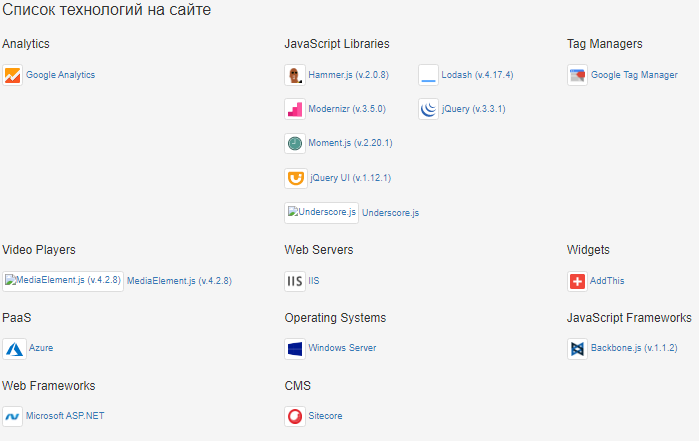
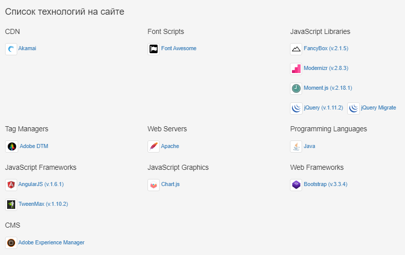
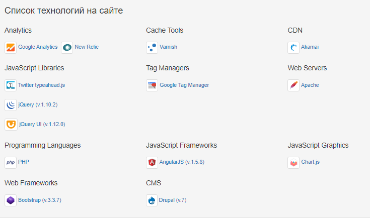
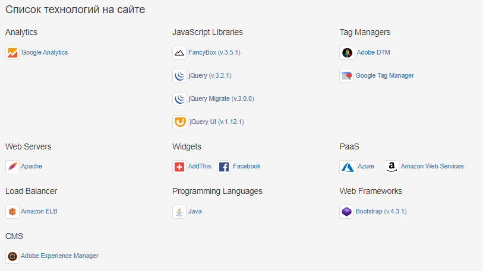
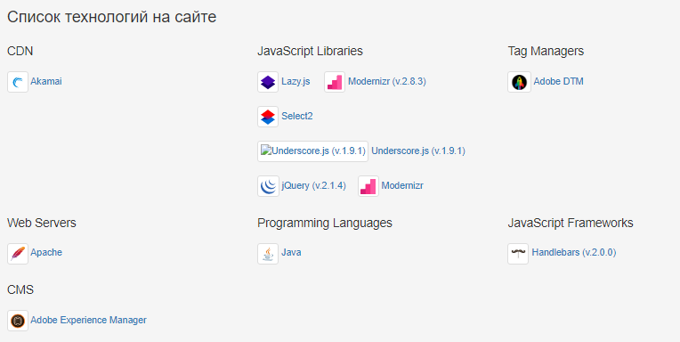

 
МИНОБРНАУКИ РОССИИ  
Федеральное государственное бюджетное образовательное учреждение высшегообразования 
**"МИРЭА - РОССИЙСКИЙ ТЕХНОЛОГИЧЕСКИЙ УНИВЕРСИТЕТ"**  
Лабораторная работа: "Сбор информации о компаниях"       

Выполнил: студент 4 курса 
специальности 10.05.05 группы ББСО-02-16 
Жумаева В.А. 
Проверил: 
Захарчук И.И.
     
Москва, 2020   

<h3>**Цель работы:**</h3> Cобрать информацию о 5 компаниях из списка S&P.  
<h3>**Исходные данные:**</h3> 
1. Ноутбук Lenovo ideapad 330-15AST. 
2. OS Linux. 
3. Nmap - свободная утилита, предназначенная для разнообразного настраиваемого сканирования IP-сетей.  

<h2>**Altria Group Inc.**
</h2> 
<u>Altria Group Inc.</u> - американская компания, один из лидеров мирового рынка табачных изделий. 

**№** |   **Признак**   |     **Значение**
-------|-----------------|-----------------------
 **1** |      Сайт       | [www.altria.com](https://www.altria.com) 
 **2** |    IP-адрес     | *165.160.13.20*  
 **3** | Местонахождение | Richmond, VA 23230-1723, United States
 **4** |    Телефон      | *+1-804-274-2200* 
 **5** |     E-mail      | domain.administration@altria.com
 **6** |     Порты       | 
 **7** |     Хостинг     | 
 **8** |  Web-технологии |  

 <h2>
**McDonalds Corporation**
</h2> 
<u>McDonalds Corporation</u> -  американская корпорация, работающая в сфере общественного питания. 

**№** |   **Признак**   |     **Значение**
-------|-----------------|-----------------------
 **1** |      Сайт       | [www.mcdonalds.com](https://mcdonalds.com) 
 **2** |    IP-адрес     | *52.6.111.61*  
 **3** | Местонахождение | Ashburn, Virginia 20147, United States
 **4** |    Телефон      | *+1-630-623-7345* 
 **5** |     E-mail      | dns.manager@us.mcd.com
 **6** |     Порты       | 
 **7** |     Хостинг     | 
 **8** |  Web-технологии | 

 <h2>
**General Electric Company**
</h2> 
<u>General Electric Company</u> - американская многоотраслевая корпорация, производитель многих видов техники. 

**№** |   **Признак**   |     **Значение**
-------|-----------------|-----------------------
 **1** |      Сайт       | [www.ge.com](https://ge.com) 
 **2** |    IP-адрес     | *204.74.99.100*  
 **3** | Местонахождение |5 Necco Street Boston, MA 02210
 **4** |    Телефон      | *+1-617-443-3000* 
 **5** |     E-mail      | domain.admin@ge.com
 **6** |     Порты       | 
 **7** |     Хостинг     | 
 **8** |  Web-технологии | 

 <h2>
**Honeywell International Inc.**
</h2> 
<u>Honeywell International Inc.</u> - американская корпорация, производящая электронные системы управления и автоматизации. 

**№** |   **Признак**   |     **Значение**
-------|-----------------|-----------------------
 **1** |      Сайт       | [www.honeywell.com](https://www.honeywell.com/) 
 **2** |    IP-адрес     | *104.40.48.29*  
 **3** | Местонахождение | Charlotte, North Carolina, United States
 **4** |    Телефон      | *1-877-841-2840* 
 **5** |     E-mail      | detectgas@Honeywell.com
 **6** |     Порты       | 
 **7** |     Хостинг     | 
 **8** |  Web-технологии | 
 
 <h2>
**Medtronic plc**
</h2> 
<u>Medtronic plc</u> - один из крупнейших производителей медицинского оборудования. 

**№** |   **Признак**   |     **Значение**
-------|-----------------|-----------------------
 **1** |      Сайт       | [www.medtronic.com](https://www.medtronic.com/) 
 **2** |    IP-адрес     | *144.15.107.150*  
 **3** | Местонахождение | 20 Lower Hatch Street Dublin 2, Ireland
 **4** |    Телефон      | *+1-763-514-4000* 
 **5** |     E-mail      | mdt-dreg-tech@medtronic.com
 **6** |     Порты       | 
 **7** |     Хостинг     | 
 **8** |  Web-технологии | 
 
**Вывод:** с помощью различных утилит мы собрали информацию о 5 компаниях из списка S&P.
